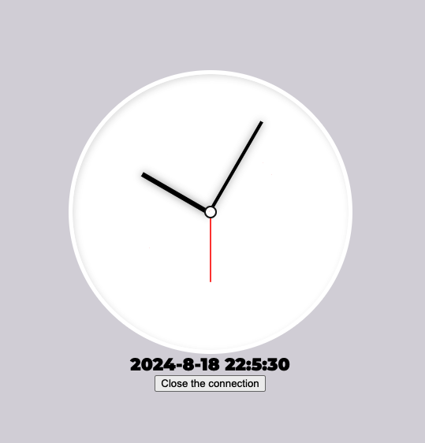

## SSE(Server Sent Events) Demo in Go

This is a simple demo of SSE(Server Sent Events) in Go. It uses the `net/http` package to create a simple HTTP server that sends a message to the client every 1 second.

Please check [the blog](https://velog.io/@rookiecj/Server-Sent-EventSSE) for the detailed explanation of the code.

